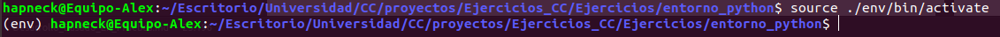

# Ejercios sobre Desarrollo Basado en Pruebas

---

### Ejericio 1: Instalar alguno de los entornos virtuales de node.js (o de cualquier otro lenguaje con el que se esté familiarizado) y, con ellos, instalar la última versión existente, la versión minor más actual de la 4.x y lo mismo para la 0.11 o alguna impar (de desarrollo).

Hecho. He decido instalar virtualenv para Python. De esta forma tengo la posibilidad de crear entornos aislados para Python, de tal forma que puedo instalar ciertos paquetes y una versión concreta del motor de Python sin interferir en otros entornos que pueden tener otros paquetes y otra versiones del motor.

---

### Ejercicio 2: Ejecutar un programa básico que trabaje con una base de datos en diferentes versiones del lenguaje. ¿Funciona en todas ellas?

Voy a crear en entorno con virtualenv que utilice la base de datos MySQL. El primer paso, obviamente, es instalar el entorno virtual, especificando como ruta el directorio de este repositorio localmente en mi computador:

`> virtualenv ./entorno_python/env`

Queremos que ejecute una versión concreta de Python. Esto lo podemos especificar de la siguiente forma:

`> virtualenv -p /usr/bin/python3.6 ./env`

Una vez tenemos creado nuestro entorno, es importante activarlo y podemos hacerlo a traves de un script que se genera automáticamente en el propio entorno:

`> source ./env/bin/activate`

Podemos comprobar que nos encontramos dentro del entorno porque en el prompt de shell, en el lado izquierdo aparece el nombre del entorno que habíamos asignado (env), tal y como se aprecia en la imagen:

 

 A partir de ahora cualquier comando o script de python se ejecutara en ese entorno virtual. Si queremos desactivar el entorno virtual, simplemente debemos poner:

 `> deactivate`

 Podemos encontrar más información sobre este proceso en el [siguiente enlace](https://osl.ugr.es/2016/10/17/entornos-virtuales-en-python-con-virtualenv/).

 Ahora mi intención es crear una base de datos MongoDB y asociarla a este entorno virtual que acabamos de crear. Para ello he seguido este [enlace](http://gpd.sip.ucm.es/rafa/docencia/nosql/MongoyPython.html#Instalaci%C3%B3n).

 Para ello tenemos que instalar pymongo en nuestro entorno virtual. Estando dentro del mismo:

 `(env) >`
