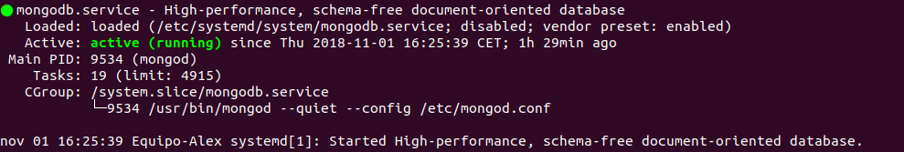
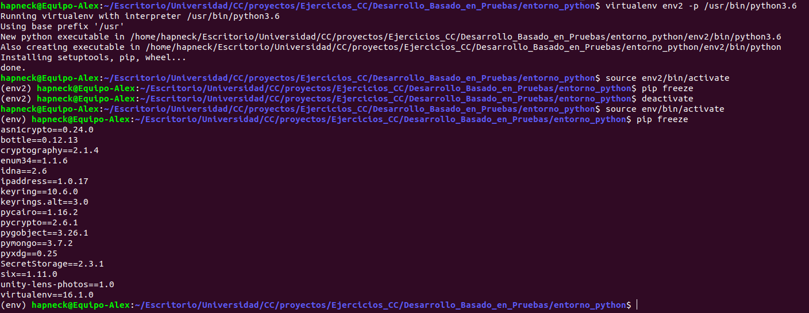
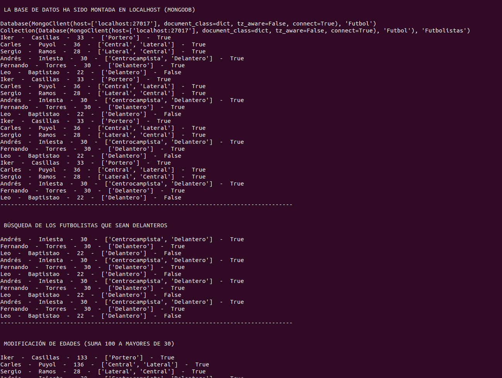
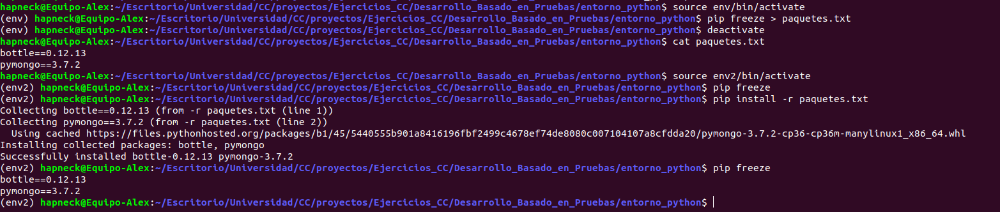
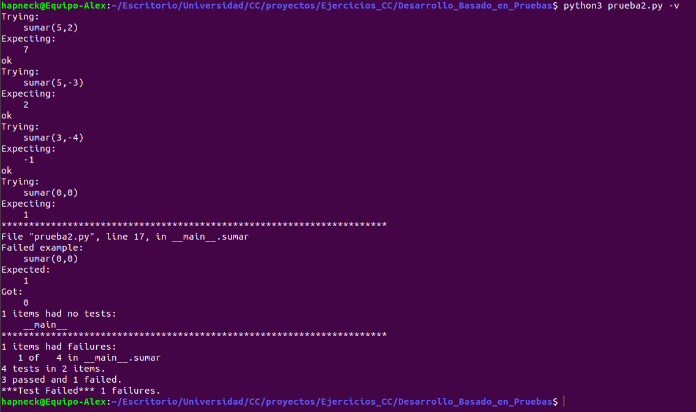

# Ejercios sobre Desarrollo Basado en Pruebas

---

### Ejericio 1: Instalar alguno de los entornos virtuales de node.js (o de cualquier otro lenguaje con el que se esté familiarizado) y, con ellos, instalar la última versión existente, la versión minor más actual de la 4.x y lo mismo para la 0.11 o alguna impar (de desarrollo).

Hecho. He decido instalar virtualenv para Python. De esta forma tengo la posibilidad de crear entornos aislados para Python, de tal forma que puedo instalar ciertos paquetes y una versión concreta del motor de Python sin interferir en otros entornos que pueden tener otros paquetes y otra versiones del motor.

---

### Ejercicio 2: Ejecutar un programa básico que trabaje con una base de datos en diferentes versiones del lenguaje. ¿Funciona en todas ellas?

Voy a crear en entorno con virtualenv que utilice la base de datos MongoDB. El primer paso, obviamente, es instalar el entorno virtual, especificando como ruta el directorio de este repositorio localmente en mi computador:

`> virtualenv ./entorno_python/env`

Queremos que ejecute una versión concreta de Python. Esto lo podemos especificar de la siguiente forma:

`> virtualenv -p /usr/bin/python3.6 ./env`

Una vez tenemos creado nuestro entorno, es importante activarlo y podemos hacerlo a traves de un script que se genera automáticamente en el propio entorno:

`> source ./env/bin/activate`

Podemos comprobar que nos encontramos dentro del entorno porque en el prompt de shell, en el lado izquierdo aparece el nombre del entorno que habíamos asignado (env), tal y como se aprecia en la imagen:

 

 A partir de ahora cualquier comando o script de python se ejecutara en ese entorno virtual. Si queremos desactivar el entorno virtual, simplemente debemos poner:

 `> deactivate`

 Podemos encontrar más información sobre este proceso en el [siguiente enlace](https://osl.ugr.es/2016/10/17/entornos-virtuales-en-python-con-virtualenv/).

 Se ha realizado la instalación de [MongoDb en Ubuntu 18.04 LTS](https://www.digitalocean.com/community/tutorials/como-instalar-mongodb-en-ubuntu-16-04-es). Podemos comprobar que el proceso se ha realizado con éxito en la siguiente imagen:

 

 El siguiente paso es conectar Python con MongoDb, para ello hacemos uso de [pymongo](https://api.mongodb.com/python/current/):

 `(env) > pip install pymongo`

 En este punto, probé a crearme otro entorno virtual a ver si contenía los mismos paquetes o no, obteniendo el siguiente resultado:

 

 Como se puede apreciar, en el segundo entorno que hemos creado no contiene paquetes instalados, mientras que en el primer entorno tenemos todos los paquetes que necesitamos.

 Una vez instalado y teniendo disponible este servicio he probado un ejemplo sacado de [este tutorial](https://jarroba.com/python-mongodb-driver-pymongo-con-ejemplos/). He modificado el código para que resulte más vistoso y he entendido como funciona MongoDb con Python, lo cual considero un objetivo muy valioso. Podemos ver parte de la ejecución de todo lo que he probado en el código de [prueba.py](https://github.com/AlejandroCN7/Ejercicios_CC/tree/master/Desarrollo_Basado_en_Pruebas/prueba.py) en la siguiente imagen:

 

 ---

###Ejercicio 3: Crear una descripción del módulo usando package.json. En caso de que se trate de otro lenguaje, usar el método correspondiente.

Aquí cabe destacar que es posible generar ficheros txt con los paquetes que queramos en su interior a modo de lista. De esta forma es posible instalarlos en otro entorno de forma sencilla, por lo que podemos configurara nuestros propios conjuntos de paquetes para montar entornos de desarrollo específicos en cualquier lugar de forma rápida.

`(env) > pip freeze > paquetes.txt`
`(env2) > pip install -r paquetes.txt`

Creo que esto es suficientemente útil para preparar cualquier entorno de forma sencilla y rápida.

---

###Ejericicio 4: Descargar el repositorio de ejemplo anterior, instalar las herramientas necesarias (principalmente Scala y sbt) y ejecutar el ejemplo desde sbt. Alternativamente, buscar otros marcos para REST en Scala tales como Finatra o Scalatra y probar los ejemplos que se incluyan en el repositorio.

---

###Ejercicio 5: Para la aplicación que se está haciendo, escribir una serie de aserciones y probar que efectivamente no fallan. Añadir tests para una nueva funcionalidad, probar que falla y escribir el código para que no lo haga (vamos, lo que viene siendo TDD).

Como nosotros estamos desarrollando desde Python, vamos a ayudarnos de [doctest](https://docs.python.org/2/library/doctest.html) para la creación de estos test. Vamos a crearnos otro código python de prueba llamado [prueba2.py](https://github.com/AlejandroCN7/Ejercicios_CC/tree/master/Desarrollo_Basado_en_Pruebas/prueba2.py) en el que he implementado una operación tan sencilla como una simple suma.

El siguiente paso es comprobar que funciona el test que hemos especificado en la implementación del mismo. Para ello ejecutamos:

`> python3 prueba2.py -v`

-v para activar verbose y obtener todos los detalles del test. Como podemos apreciar en la siguiente imagen, creé un caso de prueba en el que el resultado que espera el test, es incorrecto, no la salida del propio programa. Aunque lo normal es que sea al revés, nos servirá para comprobar el funcionamiento del mismo:

---
